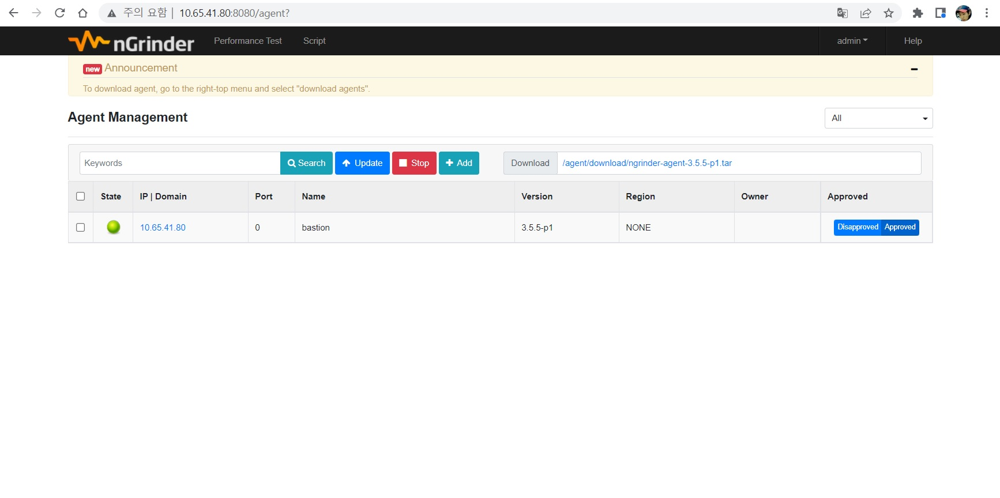
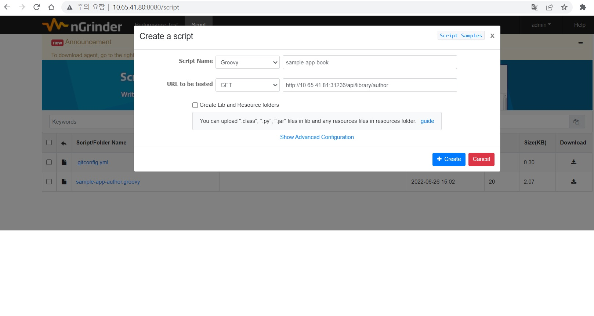
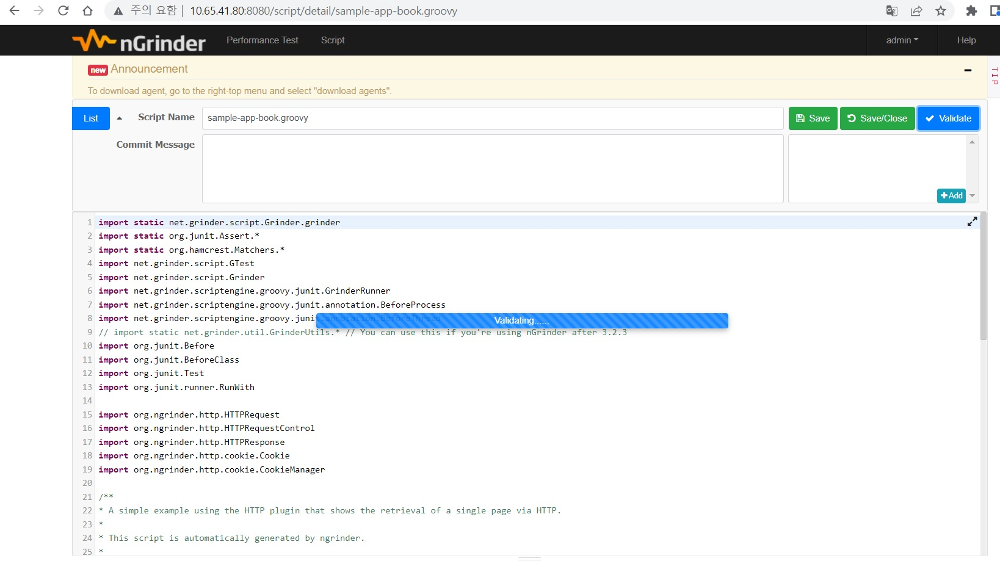
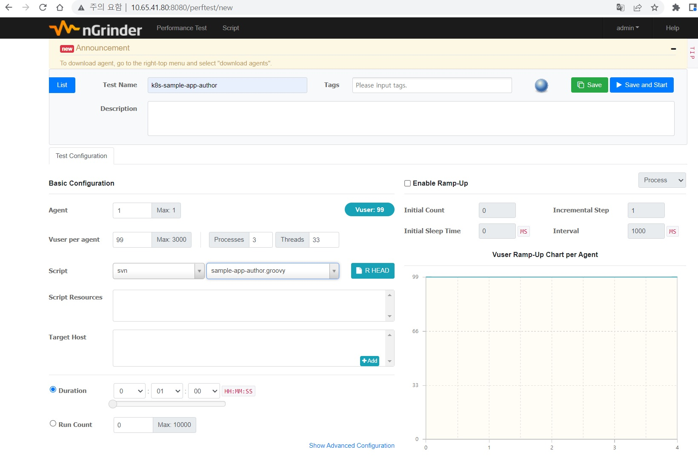
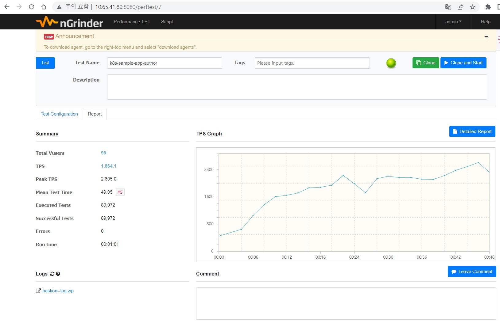

# k8s 환경에서 Prometheus 기반 모니터링 환경구성


## k8s 구성도


## k8s 시스템 구성

| Component       | 용도              |          버전 |
| :----------     | :---------------: | :-----------: |
| [Kubernetes](https://github.com/wspark/k8s-sample-app/tree/main/k8s)      | 인프라/서비스 배포 |    v1.24      |
| [Grafana](https://github.com/wspark/k8s-sample-app/tree/main/grafana)         |   모니터링 대쉬보드|   V8.5.3      |
| [Prometheus](https://github.com/wspark/k8s-sample-app/tree/main/prometheus)    |   데이터 수집      |    2.x        |
| [Tekton pipeline](https://github.com/wspark/k8s-sample-app/tree/main/tekton) |    CI/CD 구현     |      v0.27.0   |

## 기타시스템 구성

| Component      | IP             | 용도                             |          버전         |
| :------------- | :----------    | :--------------------------------| ---------------------:|
| Bastion        | 10.65.41.80    |  k8s 클러스터 관리/NFS 저장소     |    CentOS 7.9         | 
| nGrinder       | 10.65.41.80    |  성능테스트 Tool                  |   v3.5.5-p1          | 
| MariaDB        | 10.65.40.100   |  RDBMS                           |     10.3             | 


## 어플리케이션 구성

* 샘플 어플리케이션은 https://javatodev.com/spring-boot-mysql 참고하여 작성
* 도서대출 CRUD API로 구성됨.
* 어플리케이션 구성 Component

| Component       | 용도                              |          설명         |
| :-------------  | :--------------------------------| ----------------------:|
| JDK             |  Java 개발 환경                   |   openjdk 1.8          | 
| [SprintBoot](https://github.com/wspark/k8s-sample-app/tree/main/springboot-sample)     |  Java 프레임워크                  |    v2.7.0              | 
| Sprint Data JPA | JPA기반 repository 생성 Library   |    v2.7.0              | 
| LomBok          | 반복적인 코드를 줄이는 Library    |      1.18.24            | 
| Actuator        | 어플리케이션 모니터링을 제공하게 해주는 Library |v2.7.0      | 


## 어플리케이션 성능테스트

### nGrinder 구성

* controller 설치
```
# ngrinder3.5.5 설치
wget https://github.com/naver/ngrinder/releases/download/ngrinder-3.5.5-p1-20210531/ngrinder-controller-3.5.5-p1.war

# ngrinder controller 실행
java -jar -XX:MaxPermSize=512m ngrinder-controller-3.5.5-p1.war

```
* Admin 접속 : http://10.65.41.80:8080

* agent 설치

```
# admin 콘솔접속 후 admin -> Download Agent 에서 다운가능
# agent 설치
sh ./ngrinder-agent/run_agent.sh
```
* Controller 및 Agent 설치 후 Admin 콘솔에서 확인(admin -> Agent Management 화면)




### 스크립트 작성

* 콘솔에서 Script 작성이 가능하며 sample 어플리케이션 API를 호출한다.



* 스크립트는 groovy로 작성 validate 확인 후 사용가능하다.




### 부하발생

* 시나리오를 작성해야하며 기 작성된 스크립트를 실행하며 Agent/Vuser/테스트수행시간 등을 설정




* 테스트 수행이 완료되면 Vuser/TPS/Error/Run time 등이 확인된다.



## Reference 참고 링크
* [nGrinder](https://github.com/naver/ngrinder) 


## TO-DO list
* 로깅시스템 구성(EFK)하여 k8s/어플리케이션 로그 관리
* 어플리케이션 MSA 형태로 변경(boot/auth/member)
* Istio/Jager 구성하여 cricuitbreader 적용 및 distributed traceing 구현
* Argocd 구성하여 배포자동화 및 멀티클러스터 배포 구현 
* APM Scouter 구성


