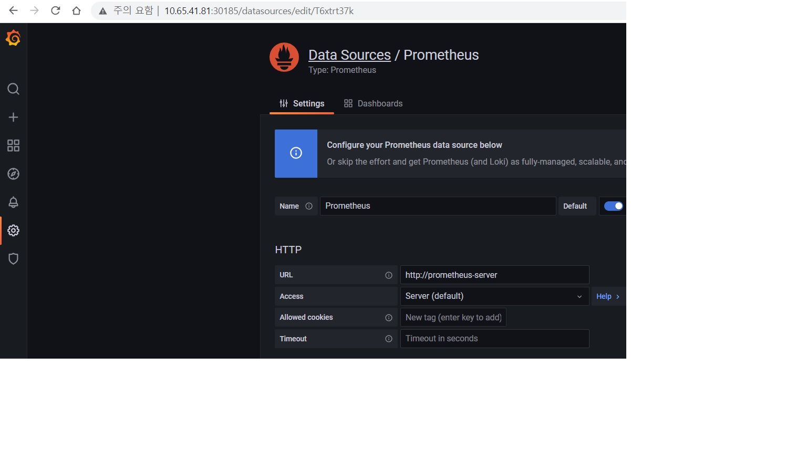
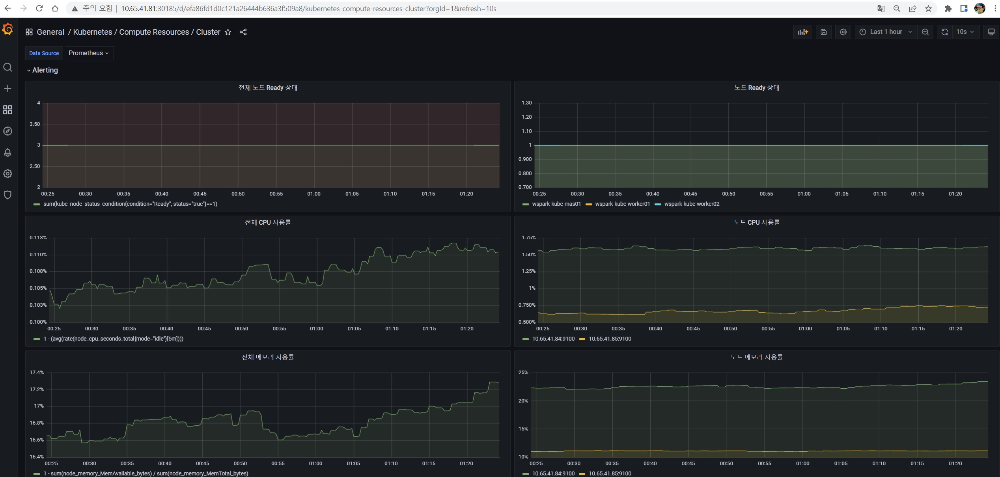

# grafana 구성

prometheus 에서 수집되는 데이터를 grafana에서 시각화하여 보여주는 도구이며 알림설정을 통해 여러 채널에 알람을 보낼 수 있다.
본 구성에서는 K8s 클러스터/Springboot 어플리케이션을 모니터링/알림 기능 구현을 보여준다.

## grafana 설치

설치는 Helm 을 통해 진행함.

### grafana helm repo 추가
```text
# helm 으로 repo 추가 및 설치
$ helm repo add grafana https://grafana.github.io/helm-charts
$ helm repo list 
NAME                	URL                                               
grafana             	https://grafana.github.io/helm-charts
$ helm install grafana grafana/grafana -n monitoring
```
### grafana data 저장용 PVC 생성
```text
# NFS 구성된 서버에 저장
$ kubectl create -f grafana-pv.yaml
$ kubectl create -f grafana-pvc.yaml
$ kubectl get pvc -n monitoring
NAME                      STATUS   VOLUME                       CAPACITY   ACCESS MODES   STORAGECLASS   AGE
grafana                   Bound    grafana-pv                   10Gi       RWX                           8h
```

### grafana deployment 수정(PVC mapping)
```text
$ kubectl edit deployment grafana -n monitoring

124       - name: storage
125         persistentVolumeClaim:
126           claimName: grafana

```

### grafana 접속
```text
# grafana svc를 nodeport로 노출하여 k8s 클러스터 IP로 접근 (http://10.65.41.81:30185)
kubectl -n monitoring  patch svc/grafana -p '{"spec":{"type":"NodePort"}}'
kubectl get svc -n monitoring
NAME                            TYPE        CLUSTER-IP       EXTERNAL-IP   PORT(S)        AGE
grafana                         NodePort    10.107.139.164   <none>        80:30185/TCP   2d3h

# 접속 패스워드 확인(secret)
kubectl get secret --namespace monitoring grafana -o jsonpath="{.data.admin-password}" | base64 --decode ; echo
PY8gCebDmxjz5WkCSyiultcliorrCHMAPMFP5Duo
```

## grafana - prometheus 연계

대쉬보드를 구성하기 위해서는 데이터가 필요한데 해당 데이터를 prometheus와 연계를 하기 위해서는 Datasource 등록을 해야함
prometheus의 URL은 k8s내에 동일 프로젝트에 있어 svc주소로 접근할 수 있어 prometheus-server를 입력함

[콘솔로긴 후 왼쪽 메뉴]
"Configuration -> DataSource ->  Add data source -> Prometheus [선택] -> URL : http://prometheus-server 입력 후 Save & Test 클릭



### k8s 클러스터 전체 모니터링 구성

k8s 클러스터에 대한 대쉬보드를 구성하였으며 클러스터의 노드상태/CPU/메모리/디스크/네트워크 사용량에 대한 항목을 구성하였음



### SpringBoot 샘플어플리케이션 구성

SprintBoot 기반의 어플리케이션을 모니터링 하기 위해서는 Actuator라는 모듈의 설정을 통해 prometheus에 springboot의 metric을 연계 할 수 있으며
호출에 대한 request 건수/Respose 시간, JVM 사용량 등을 구성하였음

"완료후 캡처필요"


## grafana 알림설정 설정

Grafana에서는 AlertRule을 통해서 특정조건일 경우 알람을 여러채널(Email, Slack, LINE 등)로 보낼 수 있으며
샘플에서는 LINE 메신저로 알람을 보내도록 구성하였음(Line의 token은 https://notify-bot.line.me 에서 발급)

### 알림항목
k8s 클러스터 노드가 1개 이상 NotReady 인 경우
k8s 클러스터 노드 CPU사용률이 입계치(50%) 이상인 경우

springboot pod down 인 경우
응답지연/cpu 사용량/스레드 사용량 입계치 이상일 경우 


### 알림확인


