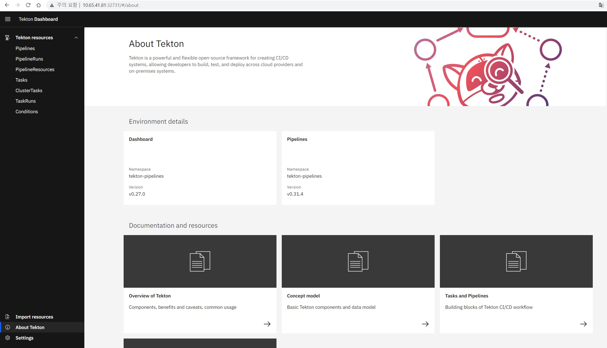

# tekton 구성

## tekton CI/CD 구성


## tekton 설치
```text
# tekton engine install
$ kubectl apply -f https://storage.googleapis.com/tekton-releases/pipeline/previous/v0.31.4/release.yaml
# tekton dashboard install
$ kubectl apply --filename https://storage.googleapis.com/tekton-releases/dashboard/latest/tekton-dashboard-release.yaml

# tekton component 확인
$ kubectl get all -n tekton-pipelines
NAME                                              READY   STATUS    RESTARTS   AGE
pod/tekton-dashboard-55f695f747-grtsv             1/1     Running   0          101s
pod/tekton-pipelines-controller-844fdd85b-wsxmz   1/1     Running   0          2m47s
pod/tekton-pipelines-webhook-549d8b8bcf-djfmg     1/1     Running   0          2m47s

NAME                                  TYPE        CLUSTER-IP      EXTERNAL-IP   PORT(S)                              AGE
service/tekton-dashboard              ClusterIP   10.107.63.255   <none>        9097/TCP                             101s
service/tekton-pipelines-controller   ClusterIP   10.102.29.12    <none>        9090/TCP,8008/TCP,8080/TCP           2m47s
service/tekton-pipelines-webhook      ClusterIP   10.104.237.72   <none>        9090/TCP,8008/TCP,443/TCP,8080/TCP   2m47s

NAME                                          READY   UP-TO-DATE   AVAILABLE   AGE
deployment.apps/tekton-dashboard              1/1     1            1           101s
deployment.apps/tekton-pipelines-controller   1/1     1            1           2m47s
deployment.apps/tekton-pipelines-webhook      1/1     1            1           2m47s

NAME                                                    DESIRED   CURRENT   READY   AGE
replicaset.apps/tekton-dashboard-55f695f747             1         1         1       101s
replicaset.apps/tekton-pipelines-controller-844fdd85b   1         1         1       2m47s
replicaset.apps/tekton-pipelines-webhook-549d8b8bcf     1         1         1       2m47s

NAME                                                           REFERENCE                             TARGETS          MINPODS   MAXPODS   REPLICAS   AGE
horizontalpodautoscaler.autoscaling/tekton-pipelines-webhook   Deployment/tekton-pipelines-webhook   <unknown>/100%   1         5         1          2m47s

# tekton svc NodePort 변경
$ kubectl patch service/tekton-dashboard -p '{"spec":{"type":"NodePort"}}' -n tekton-pipelines
$ kubectl get svc -n tekton-pipelines
NAME                          TYPE        CLUSTER-IP      EXTERNAL-IP   PORT(S)                              AGE
tekton-dashboard              NodePort    10.107.63.255   <none>        9097:32731/TCP                       4m30s
tekton-pipelines-controller   ClusterIP   10.102.29.12    <none>        9090/TCP,8008/TCP,8080/TCP           5m36s
tekton-pipelines-webhook      ClusterIP   10.104.237.72   <none>        9090/TCP,8008/TCP,443/TCP,8080/TCP   5m36s

```

* http://$k8s클러스터IP:32731


## tekton Task/pipeline


### tekton Task 생성
```text
# git clone task
kubectl create -f https://raw.githubusercontent.com/tektoncd/catalog/main/task/git-clone/0.6/git-clone.yaml -n tekton-pipelines
# maven task
kubectl create -f https://raw.githubusercontent.com/tektoncd/catalog/main/task/maven/0.2/maven.yaml -n tekton-pipelines
# buildah task(image build)
kubectl create -f https://raw.githubusercontent.com/tektoncd/catalog/main/task/buildah/0.3/buildah.yaml -n tekton-pipelines
# deploy task(kubectl commander)
kubectl create -f https://raw.githubusercontent.com/tektoncd/catalog/main/task/kubernetes-actions/0.2/kubernetes-actions.yaml -n tekton-pipelines

```
### tekton pipeline
```text
$ kubectl create -f pipeline.yaml
```

### tekton workspace(PVC 생성)

* tekton pipeline 수행간에 데이터 저장용 workspace 용도
```text
kubectl create -f tekton-pv.yaml 
kubectl create -f tekton-pvc.yaml 
```
## tekton 수행


### tekton pipelinerun

### tekton pipelinerun log


